# May 01: Came up with Project Idea:

Squirrels got into the strawberries in my garden--normal defenses don't work--so maybe I should do something about it.

NOTE: Everything software related was cut, to reduce the time from 140 to 27 hours. Was told to do this by Forge reviewer. 

**Total Time Spent: 0.25 hours**

# May 05: Further Researched Idea:

I was busy with an Algerbra test. When I was ready, I found out that there were companies who make squirrel/pest/dear detectors and like turn on lights. They don't seem to be super effective though, based on the reviews.

**Total Time Spent: 0.5 hours**

# June 25: raspberry pi + npu stuff

Can review original journal for everything that happened inbetween. context: I finished training the ai model.
It got REALLY hot with the raspberry pi, especially when I left stuff running for a while. I installed a custom fan on it because I'd rather not cook the thing before the actual project is even done.

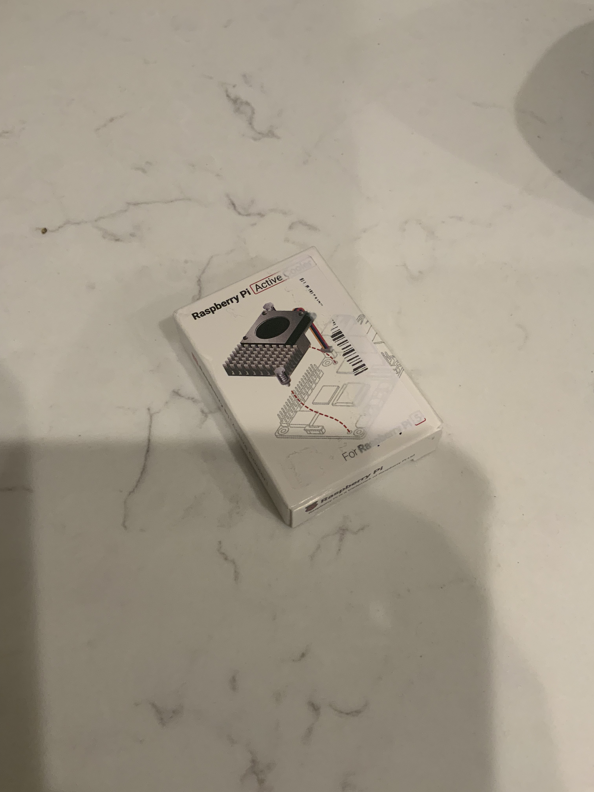

**Total Time Spent: 2 hours**

# July 24: electronics store

Since I'm in Asia I went to one of those huge computer/electronics stores because a lot of the random small parts are cheaper here. I spent like most of the day looking through wires/connectors/adapters and stuff I might need. Ended up buying a bunch of wires and small parts. Probably bought some stuff I'll never use too.

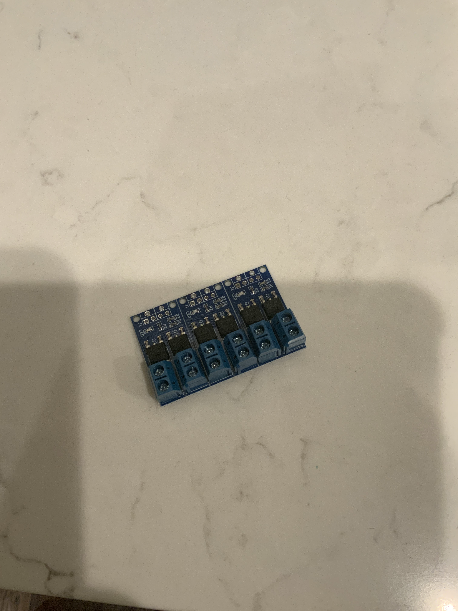

**Total Time Spent: 5.5 hours**

# July 26: figuring out what I actually bought

Went through the random parts from the store and checked what would actually be useful. Some of the wires/connectors are much better than the temporary jumper wires I was using. I also started laying out how the camera, pi, npu and water stuff might connect without becoming a giant mess.

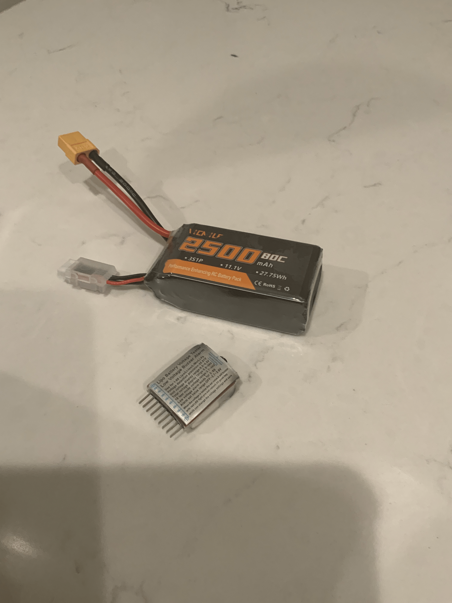

**Total Time Spent: 1.5 hours**

# July 29: camera testing

Spent a while messing around with the raspberry pi cameras. Different resolutions/frame rates obviously change how much work the system has to do, and I also need enough detail to see a squirrel far away. Tested camera positions and how much of the garden I could actually cover.

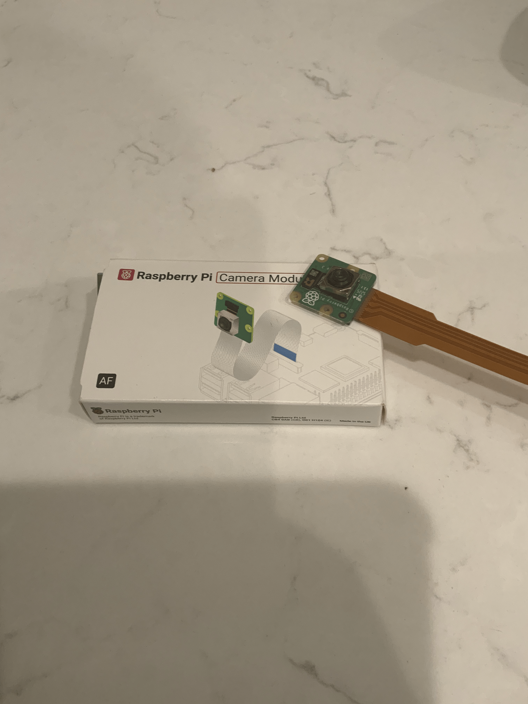

**Total Time Spent: 2.5 hours**

# August 9: Random arduino attempt

Tried working an arduino into the project for controlling the pump/physical stuff. After setting it up I realized this is kind of useless because then I need the pi to talk to the arduino just so the arduino can do something the pi can already tell a control circuit to do. Removed it again.

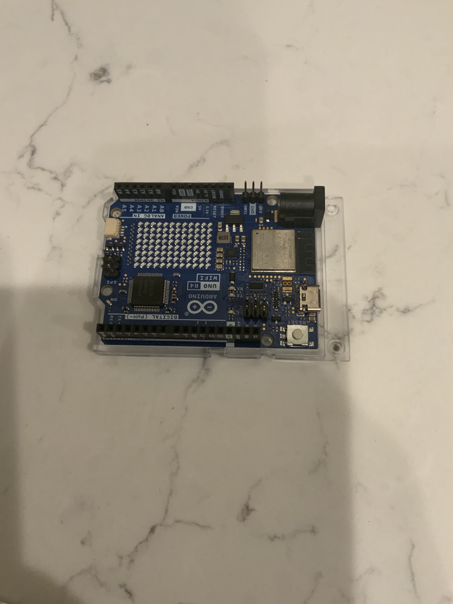

**Total Time Spent: 1 hours**

# August 11: Learning to solder

I should probably know how to solder if I'm going to have wires outside and not just a breadboard forever. Practiced on spare wires/cheap stuff first. My first ones were pretty bad but after doing a bunch I could make connections that didn't immediately come apart.

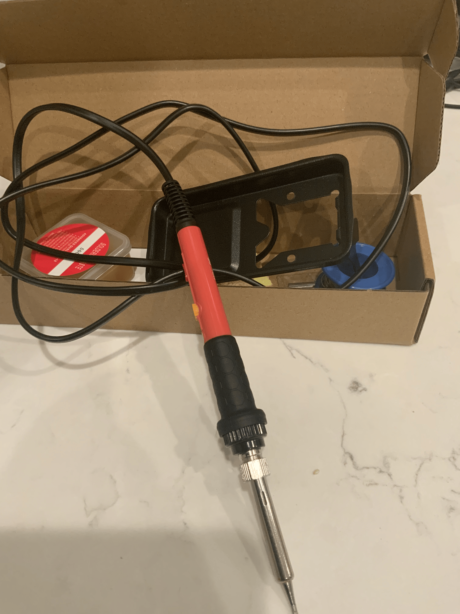

**Total Time Spent: 2 hours**

# August 13: water pump tests

Worked on the pump separately so I wasn't spraying water every time the AI code had a bug. Tested turning it on/off through the control side and used short bursts. Also made sure I wasn't trying to power the pump straight from the raspberry pi because that would obviously be bad.

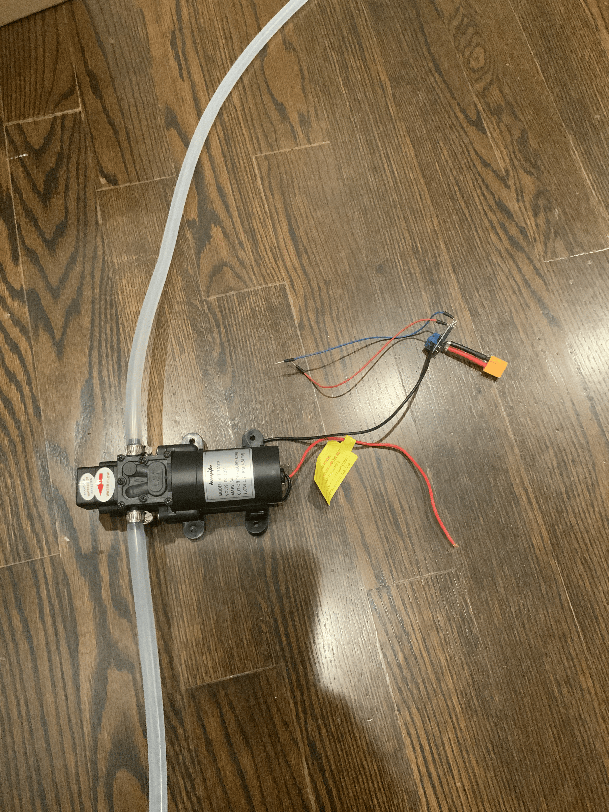

**Total Time Spent: 2 hours**

# August 15: wiring everything together (kind of)

Started connecting more of the actual system together instead of having separate camera/AI/pump tests. I still kept the water disconnected for a lot of it.

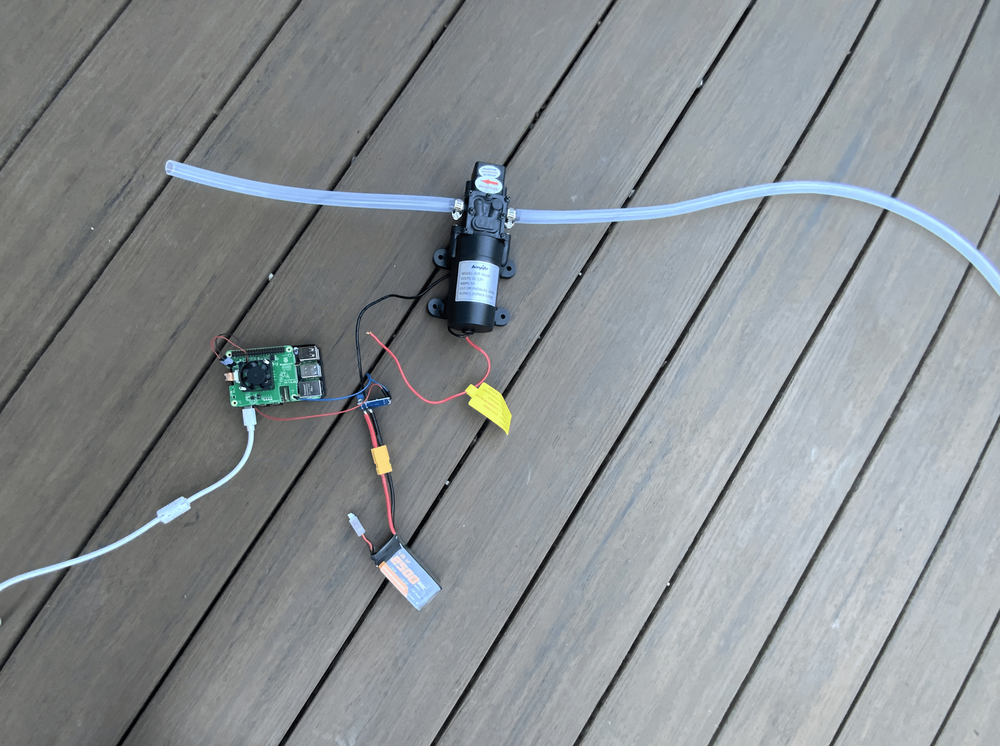

**Total Time Spent: 2 hours**

# August 17: case/cooling problem

Tried figuring out how everything is supposed to fit in a case. The problem is the pi + npu want airflow, but the project also has water literally next to it. I messed around with layouts where the electronics are covered and the camera/tubing can stick out without blocking the fan.

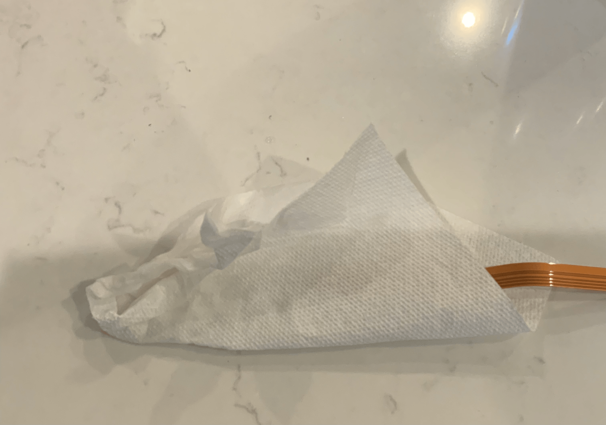

**Total Time Spent: 1.5 hours**

# August 25: back home / rebuilding it again

After traveling I had to unpack everything and set the project up again. Checked the camera/npu/pi and all the random wires I bought, then replaced a couple really sketchy temporary connections. Somehow nothing important broke in my luggage so thats good.

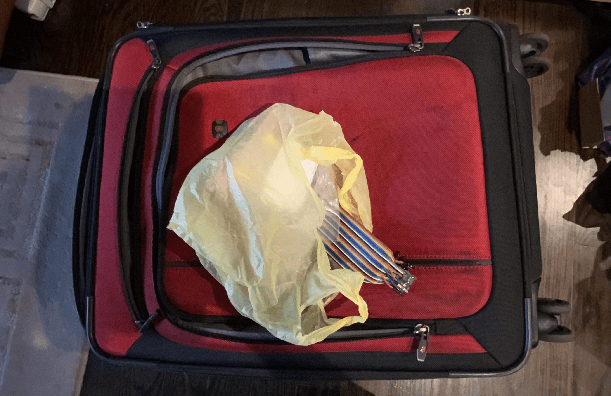

**Total Time Spent: 1 hours**

# August 27: actual water + AI test

I used short bursts because I did not want to soak the electronics while debugging. The basic idea works, although where the camera sees the squirrel vs where the water goes obviously isn't perfectly matched yet.

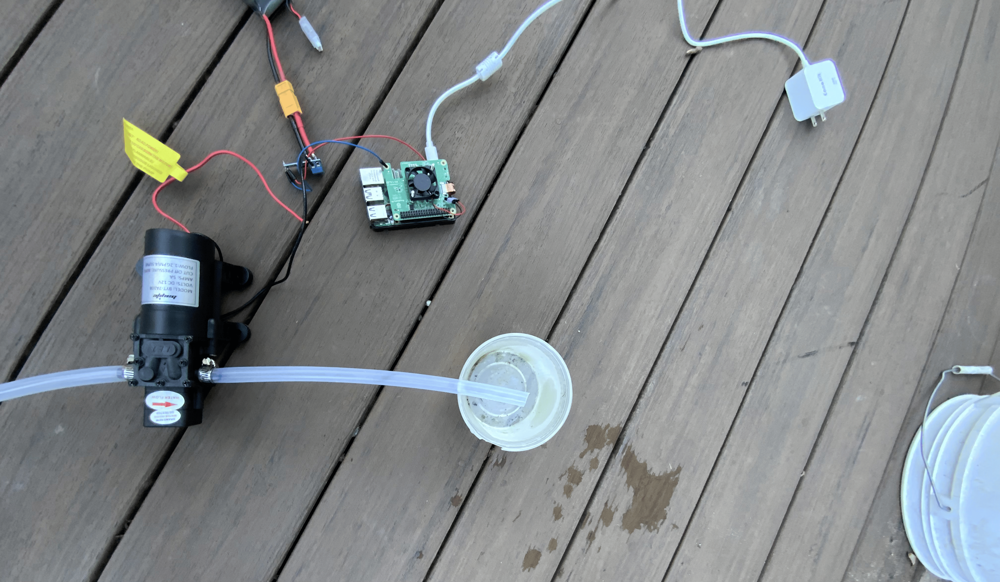

**Total Time Spent: 2 hours**

# September 6: aiming

Worked more on where the camera/water nozzle should point. For now I'm making sure it covers the area I actually care about instead of trying to build a super complicated turret too.

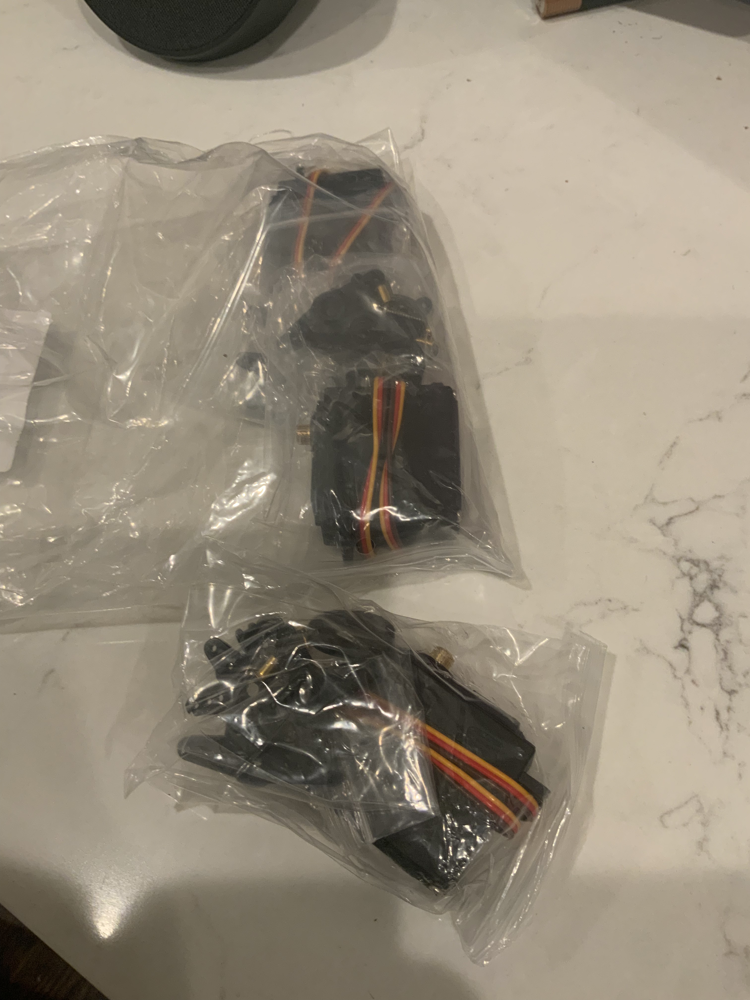

**Total Time Spent: 1 hours**

# September 14: Almost done

I think I'm almost done. I should've gotten the 3d printer. I could like 3d print like a cool tank shell to keep water out while spraying squirrels. I'll keep working on the servos. I'll finish up within a week or so. I should hurry before the squirrels start hibernating but school is also busy.

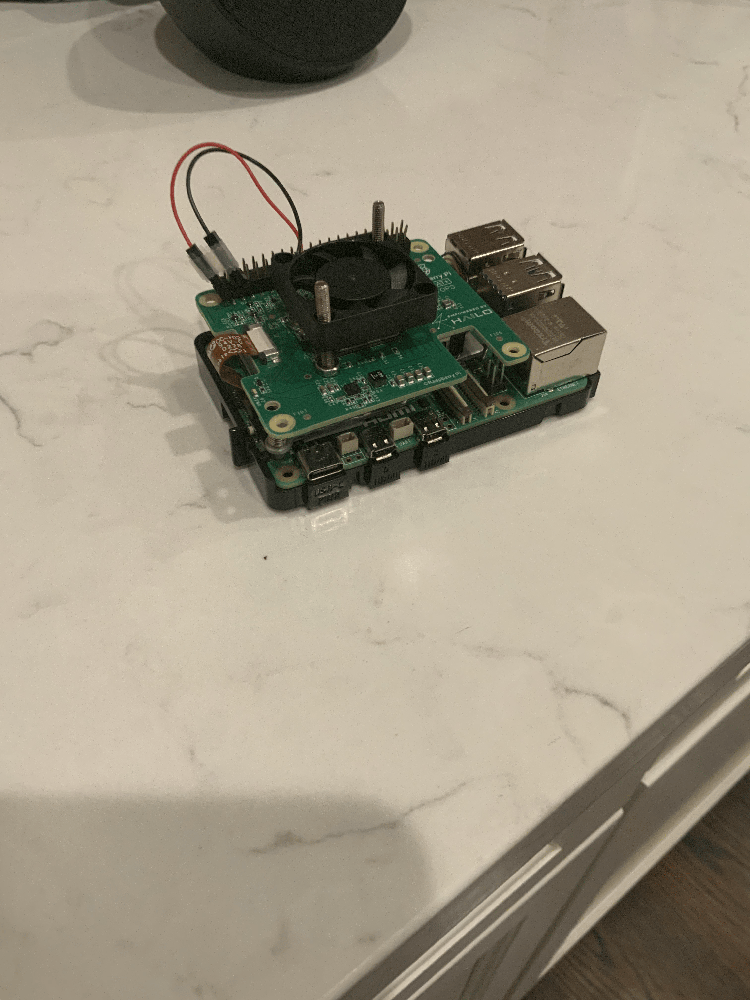

**total Time spent: 2 hours**

# September 15: It actually caught one

NOTE: Everything software related was cut, to reduce the time from 140 to 27 hours. Was told to do this by Forge reviewer. All the coding/software portions are no longer inside.

I actually caught a squirrel today. And my pump also accidently sprayed some water on my pi camera (hopefully it stills work or I'll have to fork out another 50 dollars) but thankfully I have a second one.

**Total Time Spent: 0.75 hours**
