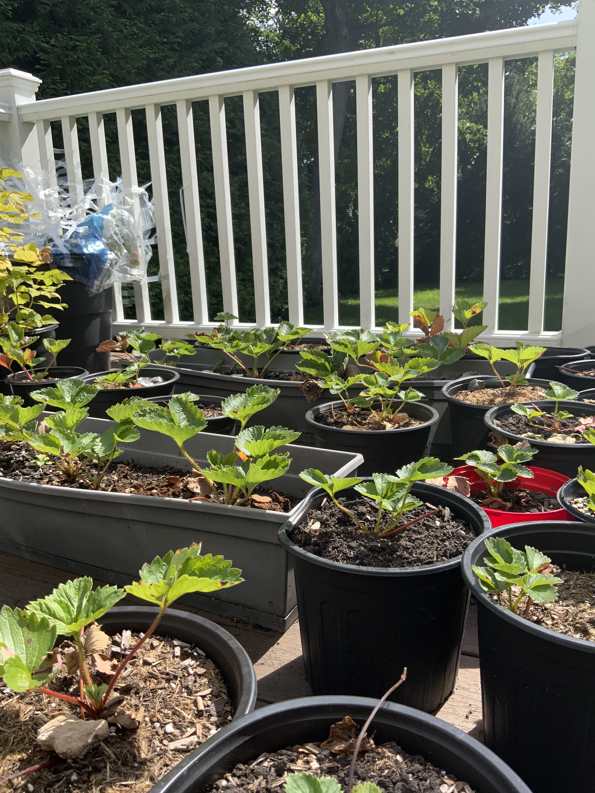
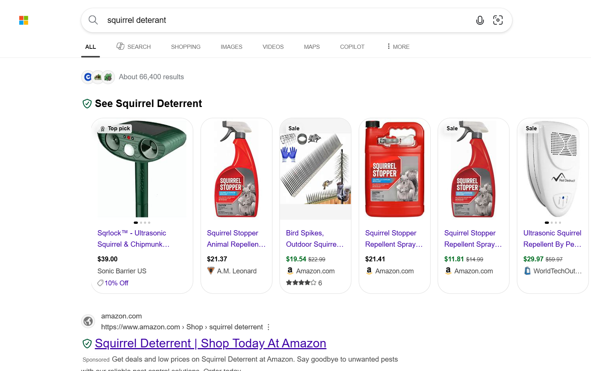
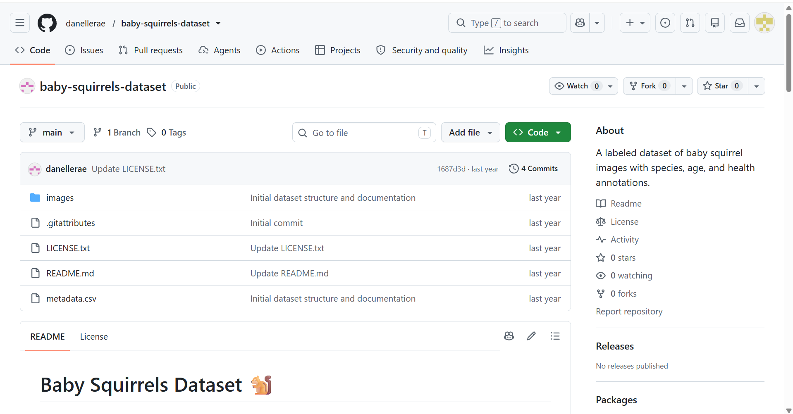
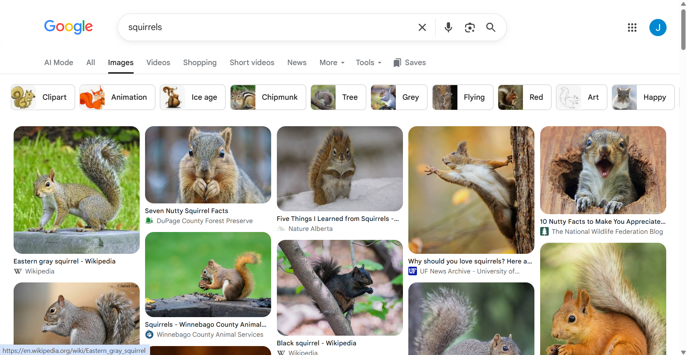
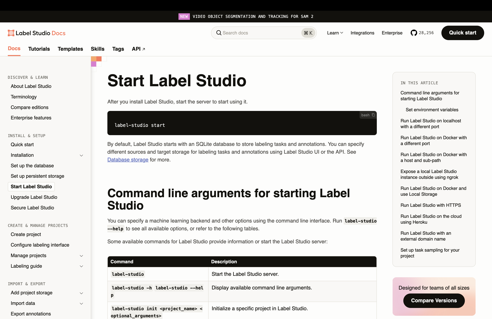
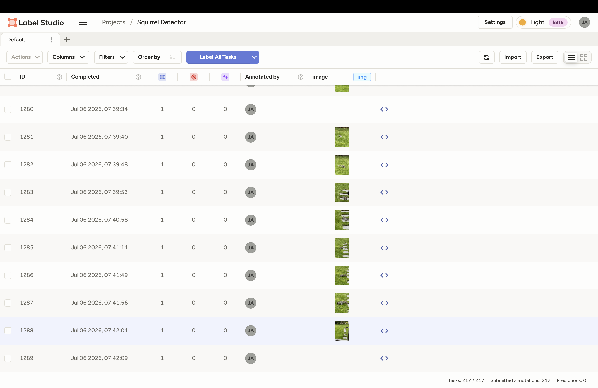
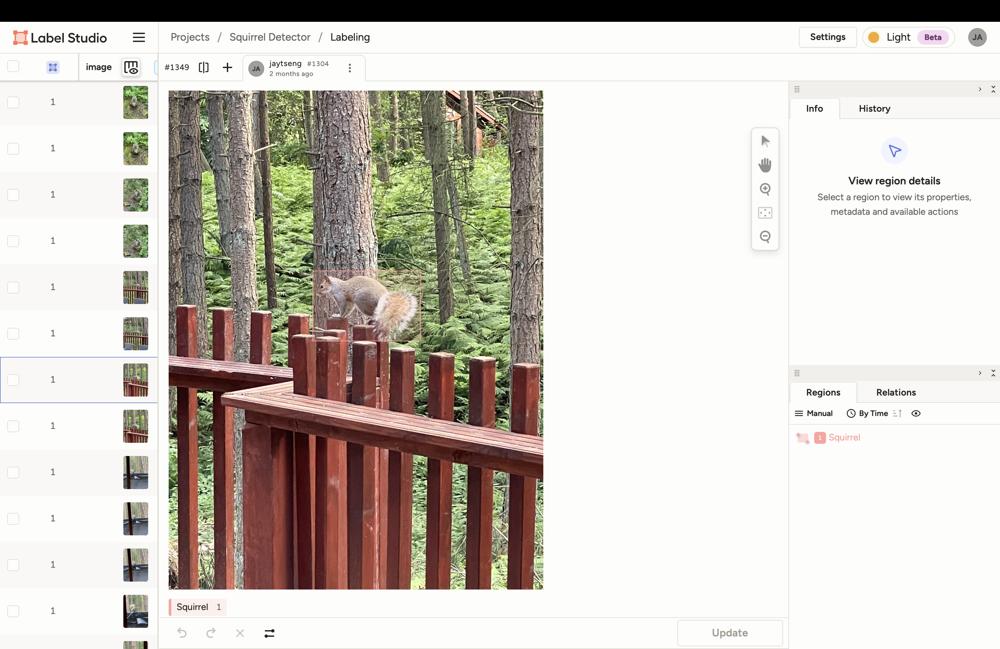
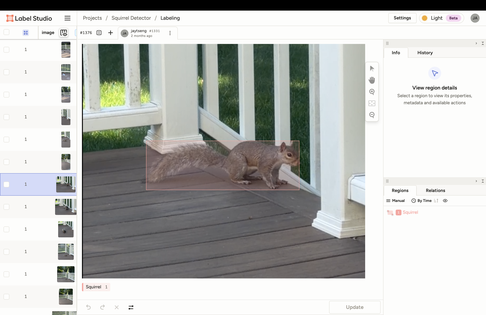
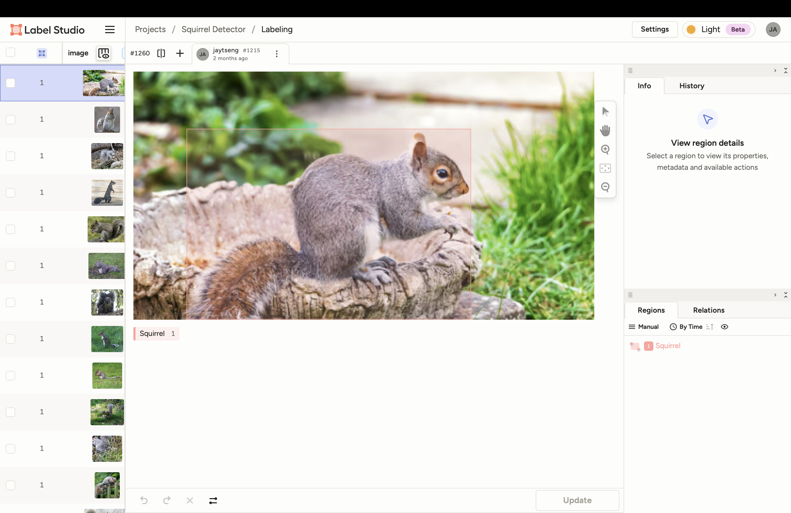

# May 01: Came up with Project Idea:

Squirrels got into the strawberries in my garden--normal defenses don't work--so maybe I should do something about it. I recently bought a rapsberry pi 5 and heard that it can run AI algorithms on it.

**Total Time Spent: 0.25 hours**

# May 05: Further Researched Idea:

I was busy with an Algerbra test. When I was ready, I found out that there were companies who make squirrel/pest/dear detectors and like turn on lights. They don't seem to be super effective though, based on the reviews.

**Total Time Spent: 0.5 hours**

# May 16: Project AI model decisions

I spent this saturday researching what kind of AI model I would use. I've had previous experience with YOLO models (You Only Look Once) for a science fair project. I'll work on the AI dataset first. After that I can worry about getting it to actually run on the raspberry pi.

**Total Time Spent: 2 hours**

# May 17: How am I even getting enough squirrel pictures?

I looked around for squirrel datasets and also just normal pictures online. There are a lot of squirrel pictures, but a bunch are like perfect close up photography which is probably not what my camera will see. I tried to get different distances/backgrounds and also pictures where they are partly behind something.

**Total Time Spent: 2 hours**

# May 18: More dataset stuff

Downloaded a bunch more pictures and started sorting out the bad ones. There were duplicates, drawings, really tiny images, and random stuff that wasn't useful. I also need empty/background images eventually b/c I don't want it to just assume every picture has a squirrel in it.

**Total Time Spent: 3 hours**

# May 20: labeling :(

Started labeling the squirrel pictures with boxes. It isn't difficult but it takes FOREVER when you have this many. The tail also makes the boxes kind of weird b/c sometimes the actual squirrel takes up only part of the rectangle. Still just doing normal detection for now though.

**Total Time Spent: 4 hours**

# May 21: still labeling

Did basically the same thing again. I noticed some of my first boxes were way looser than the new ones, so I went back and fixed a bunch because I don't want the AI learning random tree/background with the squirrel. I think I am getting faster at it at least.

**Total Time Spent: 4 hours**

# May 23: dataset cleanup

Finished another chunk of the labels and checked the pictures again. Some had squirrels that were so small I could barely find them, and a few had multiple squirrels. I kept some of the hard ones because thats probably more realistic than only training on the easiest pictures.

**Total Time Spent: 3.5 hours**

# May 25: More labels + garden pictures

Took/collected some normal background pictures too and kept labeling. My thinking is if the final camera is looking at grass, plants, wood, etc. all day, the model should see stuff like that without a squirrel too. I don't know how much it'll help yet but it makes sense.

**Total Time Spent: 4.5 hours**

# May 27: FINALLY almost done labeling

I spent basically the whole time going through labels again. Fixed missing tails, boxes that had way too much background, and a few pictures that I somehow forgot to label at all. This took way longer than I thought when I started the dataset.

**Total Time Spent: 4.5 hours**

# May 29: setting up training

Split the dataset for training/validation and got the YOLO11 training stuff working. I picked the smallest YOLO11 model first because the final thing has to run on a raspberry pi + npu, so using a huge model just because I can train it would kind of defeat the point.

**Total Time Spent: 4 hours**

# May 31: first real AI training

Ran the first actual long training with the smallest YOLO11 model. It definitely learned squirrels and the results looked pretty good at first, but the mAP50-95 ended up around 60%. Not horrible, but I was hoping it would be a lot better after all the labeling.

**Total Time Spent: 3 hours**

# June 02: Why is it only like 60%?

Went through the model predictions instead of just looking at the final number. It seems okay when the squirrel is obvious, but worse if its small, behind leaves, or kind of blends into a tree. The tail/background thing with the rectangle also still looked weird in some pictures. Messed around with the parameters.

**Total Time Spent: 4 hours**

# June 04: Maybe segmentation is better

I researched segmentation models because then I can outline the actual squirrel instead of making a box around it. This sounded way better especially for the tail. The problem is I realized I have to RELABEL basically everything with drawing (well techinically you could also do dots and connect them, but like same thing) instead of boxes. I already started so I guess I'm doing it now.

**Total Time Spent: 5 hours**

# June 06: segmentation labeling day 1

This is so much slower than bounding boxes. For every squirrel I have to click around the body/tail and it gets really annoying around fur, leaves, branches, etc. I did a lot today but I'm definitely not finishing this in one or two days.

**Total Time Spent: 8 hours**

# June 08: segmentation labeling day 2

More segmentation. I started getting faster but the squirrels that are behind branches are really annoying because I have to decide if I outline only what I can see or try to connect around it. I decided to mostly label what is actually visible so at least I'm consistent. and don't get me started on the tails.

**Total Time Spent: 8 hours**

# June 10: segmentation labeling day 3

Still doing this. Tails are by far the worst part because they can be fluffy and there isn't even a super clear edge sometimes. I went back through some of my old masks too because the first ones were a lot rougher than what I was doing now. I realized that my strategy becomes more and more loose the more I do. maybe I'm just that lazy.

**Total Time Spent: 6 hours**

# June 12: Finished most of the segmentation dataset

I finally got through most of it and then spent time checking the masks. Found a few completely messed up ones where I forgot the label the second squirrel(s) in the picture. Fixed those and exported it so YOLO wouldn't get super confused. I had to like limit my daily computer time.

**Total Time Spent: 5 hours**

# June 14: trained segmentation... not that much better

I trained the segmentation model and after ALL that relabeling it was only like 65-70% mAP50-95 depending on the run. So yes its better than 60%, but not enough for how much more work it took. The masks also looked kinda weird on tails/squirrels behind stuff.

**Total Time Spent: 4 hours**

# June 15: trying to figure out why

Looked through a ton of the segmentation outputs. I think squirrel fur is just kind of a terrible exact edge to label, plus branches cover random sections and my polygons probably aren't perfectly consistent. Also when the squirrel is small in the image, the exact outline probably matters less anyway.

**Total Time Spent: 3 hours**

# June 17: tried segmentation again

Changed some of the training settings and ran it again because I didn't want all the segmentation work to be useless. It moved around a little but it still wasn't some giant improvement. At this point I think the problem isn't just "boxes bad, segmentation good."

**Total Time Spent: 4 hours**

# June 18: back to the original dataset

Went back to the original bounding box dataset and tried just using a bigger YOLO11 model. This is kind of stupid but it worked way better almost immediately. I got close to 80% mAP50-95 without having to use the segmentation dataset at all.

**Total Time Spent: 3 hours**

# June 20: messed with training settings basically all day

Since the bigger model actually worked, I spent most of today changing parameters and retraining. Tried image size, augmentations, epochs/patience, and some other settings. Some made it worse. Some made it like 1-2% better. I'm gonna crashout b/c of the time I spent on this.

**Total Time Spent: 5 hours**

# June 22: Picked the model I'm actually using

Compared the runs and decided I'm sticking with normal object detection + the larger model instead of segmentation. Segmentation was cool but it used way more labeling time and didn't really give enough back. Now I have to get the model onto the raspberry pi/hailo which might be another problem.

**Total Time Spent: 2.5 hours**

# June 25: raspberry pi + npu stuff

Worked on the Hailo npu and getting examples/models to run. It got REALLY hot with the raspberry pi, especially when I left stuff running for a while. I installed a custom fan on it because I'd rather not cook the thing before the actual project is even done.

**Total Time Spent: 2 hours**

# July 6th: 3d printer?

Bambu labs is having a july 4th sale and the h2d is like 30% off. Maybe I'll get it. Contemplating and researchign other options. B/c I might also use the 3d printer for other projects. Still on vacation though, so won't have time.

**Total Time spent: 1 hours**

# July 20th: I missed the end date.

I missed the end date of the sale... :( :( :(, maybe I'll try black friday. Its okay though, I did some research on my Hailo raspberry pi npu and was able to run the AI model that knows and can identify basically every object. It did 20 fps fine. It hit a few bugs with a wrong version and my npu being an old model but I used the newest sofware.

**Total Time Spent: 3 hours**

# July 24: electronics store

Since I'm in Asia I went to one of those huge computer/electronics stores because a lot of the random small parts are cheaper here. I spent like most of the day looking through wires/connectors/adapters and stuff I might need. Ended up buying a bunch of wires and small parts. Probably bought some stuff I'll never use too.

**Total Time Spent: 5.5 hours**

# July 26: figuring out what I actually bought

Went through the random parts from the store and checked what would actually be useful. Some of the wires/connectors are much better than the temporary jumper wires I was using. I also started laying out how the camera, pi, npu and water stuff might connect without becoming a giant mess.

**Total Time Spent: 1.5 hours**

# July 29: camera testing

Spent a while messing around with the raspberry pi cameras. Different resolutions/frame rates obviously change how much work the system has to do, and I also need enough detail to see a squirrel far away. Tested camera positions and how much of the garden I could actually cover.

**Total Time Spent: 2.5 hours**

# August 1: What if I just use two cameras?

I had the idea to use two cameras like eyes and then get the depth/distance of the squirrel too. Hailo has AI stuff for depth so I thought maybe this would solve aiming. Got two camera views working and started looking into binocular/stereo vision. More complicated than I thought.

**Total Time Spent: 3 hours**

# August 3: trying to turn 2 images into 3d

Spent a long time on the two camera thing. The cameras have to be lined up/calibrated and even then matching the same point in both images is not super simple. I also looked at using the Hailo depth model instead of doing all the stereo math myself.

**Total Time Spent: 3.5 hours**

# August 5: Hailo depth model

Got farther with the Hailo depth idea and tested what the whole pipeline would actually need. The issue is now I'm trying to run squirrel detection AND depth AI AND two camera streams at once. It technically sounds cool but I am starting to think I'm just making the project harder for no reason.

**Total Time Spent: 3 hours**

# August 7: probably not doing binocular vision

Looked at the NPU load/performance and I don't think running the extra depth model constantly is worth it. It would use a bunch of the accelerator just to get distance when I mainly need to know "squirrel there." I'll keep the stuff I learned but probably go back to one camera.

**Total Time Spent: 1.55 hours**

# August 9: Random arduino attempt

Tried working an arduino into the project for controlling the pump/physical stuff. After setting it up I realized this is kind of useless because then I need the pi to talk to the arduino just so the arduino can do something the pi can already tell a control circuit to do. Removed it again. The ram of the arduino is literally 0.0000038x of my pi's, and the cpu of the pi is 31.25x, while the storage of the arduino is is 0.000001x. Like I did the actual math + research for 10 usless minutes.

**Total Time Spent: 1 hours**

# August 11: Learning to solder

I should probably know how to solder if I'm going to have wires outside and not just a breadboard forever. Practiced on spare wires/cheap stuff first. My first ones were pretty bad but after doing a bunch I could make connections that didn't immediately come apart.

**Total Time Spent: 2 hours**

# August 13: water pump tests

Worked on the pump separately so I wasn't spraying water every time the AI code had a bug. Tested turning it on/off through the control side and used short bursts. Also made sure I wasn't trying to power the pump straight from the raspberry pi because that would obviously be bad.

**Total Time Spent: 2 hours**

# August 15: wiring everything together (kind of)

Started connecting more of the actual system together instead of having separate camera/AI/pump tests. I still kept the water disconnected for a lot of it. Added the basic logic where detections can trigger an output after it sees the squirrel consistently instead of one random frame.

**Total Time Spent: 2 hours**

# August 17: case/cooling problem

Tried figuring out how everything is supposed to fit in a case. The problem is the pi + npu want airflow, but the project also has water literally next to it. I messed around with layouts where the electronics are covered and the camera/tubing can stick out without blocking the fan.

**Total Time Spent: 1.5 hours**

# August 20: got most of the system talking to each other

Camera -> AI -> squirrel result -> trigger logic is working together now. I added a cooldown because otherwise once a squirrel is detected it can just trigger over and over every frame. Still need to do better real outside testing instead of me basically trying to fake a squirrel in front of it.

**Total Time Spent: 2.5 hours**

# August 25: back home / rebuilding it again

After traveling I had to unpack everything and set the project up again. Checked the camera/npu/pi and all the random wires I bought, then replaced a couple really sketchy temporary connections. Somehow nothing important broke in my luggage so thats good.

**Total Time Spent: 1 hours**

# August 27: actual water + AI test

Connected the water side again and tested the AI trigger with it. I used short bursts because I did not want to soak the electronics while debugging. The basic idea works, although where the camera sees the squirrel vs where the water goes obviously isn't perfectly matched yet. I heard that if you drop a lithium ion battery in water it becomes a grenade (with two explosions). Also school is going to start soon and I won't be able to work on it as much.

**Total Time Spent: 2 hours**

# August 30: outside testing

Put/tested it in a more realistic spot instead of on my desk. Outside is WAY messier for the model. Leaves move, shadows change, and there are random shapes everywhere. I got a few weird detections so I wrote down what happened and started changing the confidence/trigger rules.

**Total Time Spent: 2 hours**

# September 3: false positives

Changed the confidence threshold and how many frames it needs to see a squirrel before actually triggering. Too low = random stuff can set it off. Too high = it misses harder squirrels. I just tested a bunch of values until it was less annoying without making it useless.

**Total Time Spent: 2 hours**

# September 6: aiming

Worked more on where the camera/water nozzle should point. The AI gives me where the squirrel is in the image, but that doesn't magically mean the water goes exactly there. For now I'm making sure it covers the area I actually care about instead of trying to build a super complicated turret too. School started.

**Total Time Spent: 1 hours**

# September 14: Almost done

I think I'm almost done. I should've gotten the 3d printer. I could like 3d print like a cool tank shell to keep water out while spraying squirrels. I'll keep working on the servos. I'll finish up within a week or so. I should hurry before the squirrels start hibernating but school is also busy.

**total Time spent: 2 hours**
