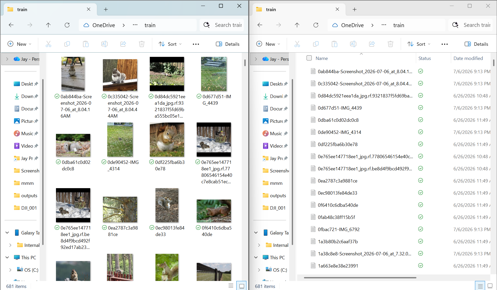

# May 01: Came up with Project Idea:

Squirrels got into the strawberries in my garden--normal defenses don't work--so maybe I should do something about it. I recently bought a rapsberry pi 5 and heard that it can run AI algorithms on it.

**Total Time Spent: 0.25 hours**

# May 05: Further Researched Idea:

I was busy with an Algerbra test. When I was ready, I found out that there were companies who make squirrel/pest/dear detectors and like turn on lights. They don't seem to be super effective though, based on the reviews.

**Total Time Spent: 0.5 hours**

# May 16: Project AI model decisions

I spent this saturday researching what kind of AI model I would use. I've had previous experience with YOLO models (You Only Look Once) for a science fair project. I'll work on the AI dataset first. After research, I only found one small squirrel dataset.

**Total Time Spent: 1 hours**

# May 17: AI labeling I

It turns out the dataset i found was unlabled. I started compiling more pictures for future labeling, using images from my backyard and online. I'll use label studio on a mac for labeling later. The dataset has 100 images, I think I'll probably need a 1000. Total: 234/1000 images. 

**Total Time Spent: 2 hours**

# May 18: AI labeling II

Was able to find another 50 images before going to school.

**Total Time Spent: 0.5 hours**

# May 20: AI Labeling III

It turns out that reddit and other social media outlets are a good place to find squirrel images. 500/1000

**Total Time Spent: 3 hours**

# May 24: AI Labeling IV

After some consideration, I don't think I'll need 1000 images, the 850 I have will probably be enough. I got another 350 today, but spent too much time getting it. It turns out theres a limited amount of eastern grey squirel pictures out there.

**Total Time Spent: 5 hours**

# May 25: Labeling V

labeling takes even longer than finding the images. Only got 250 done but the whole day is over.

**Total Time Spent: 7.25 hours**

# May 30: Labeling VI

Finished another 300 today (more efficiently then before) but will be busy for the next two weeks due to Finals.

**total Time spent: 7 hours**

# May 31: Labeling VII

Remember how I said that there wasn't any labels for the online dataset I found? I turns out there was (plus another 100 images) but it was under another different github page. But like some of them are incorrectly labeled, I'll have to sort through them. Done with the self found images.

**Total Time spent: 5.5 hours**

# June 20: Done with Finals:

I'm done with finals and am continuing development.

**Total Time spent: 1 hours**

# June 21: Created sorting
I created a simple appliation using python that lets me sort through weather or not a images was correctly labeled. Left arrow for no, right arrow for yes. I coded it and cycled htrough it today.

**Total Time spent: 5 hours**

# June 22: Prime day is coming
I realized that Prime day is coming up so I should buy everything I can during this time period. I researched what I should get. I ended up buying an $150 npu for my pi 5 this way it could actually do ai calculations in realtime. (also a bunch of other random stuff like pumps, lithium ion batteries, cameras, voltage meters, soldering irons (I'm going to learn how to solder), and an pi camera 3).

**Total Time Spent: 3 hours**

# June 23: Placed order
I placed the orders today.
**Total Time Spent: 0.25 hours**

# June 24: AI ipynb
Using my colab pro subscription, I created a colab ipynb to train the AI. B/c you can't possible train an ai model on your own computer. I selected the A100 GPU (which would've costed me 30k if I bought it myself). Ran into a few minor bugs, but my previous experience pulled through. it's late though, so I'll let it train over nightat the results tommorow. Schools also off so I have more time.

**Total Time Spent: 6.5 hours**

# June 25: Results
I woke up at 6 to look at the results. They were average or like okay. It was good at identifying squirrels, but it was over aggressive. It identified rocks and cats as squirrels and I wouldn't want to spray my neighbors cats. I reworked the model to make it a little less aggressive (will train tommorow). I also grabbed extra training images for that purpose (dog + cat + human images + rock images) this way it won't spray like anything moving. Boy did the images take forever. I tried a few images of my backyard using the pi 3 camera but not like live.

**Total Time spent: 10 hours**

# June 27: Fun updates

It turns out I've been spending too much time in front of my computer and I need stronger glasses. LOL. The shipments also arrived, I took them out, made sure that each of the servos, batteries, and pump works. Made a set up to start pumping. I soldered for the first time too, b/c the wires weren't very friendly. Watched quite a few tutorials.

**Total Time spent: 4 hours**

# June 30: Won't be able to work on for a while

I won't be able to work on it for about a month while I go on vacation. I got the npu on the raspberry pi, and it makes it really hot. Installed a custom fan on it.

**Total Time Spent: 1 hours**

# July 6th: 3d printer?

Bambu labs is having a july 4th sale and the h2d is like 30% off. Maybe I'll get it. Contemplating and researchign other options. B/c I might also use the 3d printer for other projects. Still on vacation though, so won't have time.

**Total Time spent: 1 hours**

# July 20th: I missed the end date.

I missed the end date of the sale... :( :( :(, maybe I'll try black friday. Its okay though, I did some research on my Hailo raspberry pi npu and was able to run the AI model that knows and can identify basically every object. It did 20 fps fine. It hit a few bugs with a wrong version and my npu being an old model but I used the newest sofware.
**Total Time Spent: 3 hours**
