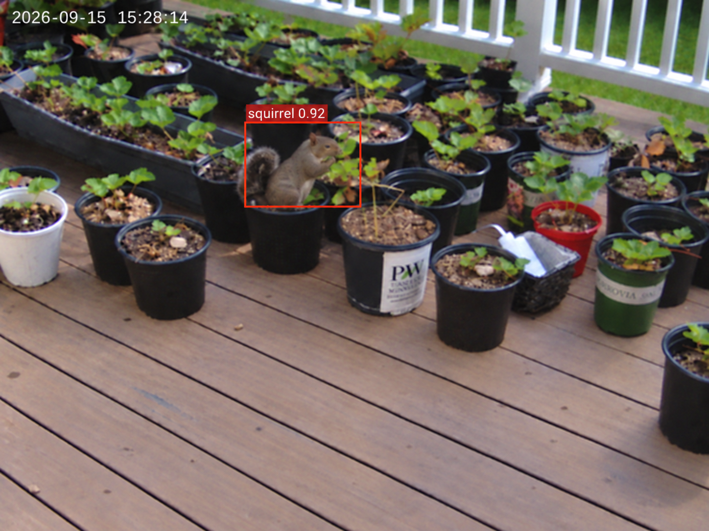

# AI Squirrel Garden Deterrent

Squirrels kept getting into the strawberries in my garden. Normal squirrel deterrents exist, but a lot of them are either always on, depend on motion sensors, or just kind of hope the squirrel gets annoyed enough to leave. I already had a Raspberry Pi 5 and some experience training YOLO models, so I decided to make something a little more specific: use AI to tell if the thing in the garden is actually a squirrel, then trigger a short burst of water.

The project ended up taking way longer than I expected because the AI was only one part of it (In fact, I don't know if I would've started the project if I've known it would take over a hundred hours) that I had to collect and clean a dataset, label everything, train multiple models, get one running on a Raspberry Pi with a Hailo accelerator, connect the camera and pump, deal with cooling/water being a terrible combination, and then actually test the thing outside.

It did eventually work. On September 15, the system detected a real squirrel sitting directly in the strawberry area with 0.92 confidence. The video-saving code decided to break at basically the worst possible time, so I only got one frame instead of the whole clip, but at least I got proof that the actual system saw it.

  

What it does

The final idea is pretty simple even though getting there wasn't:

A Raspberry Pi camera watches the part of the garden I care about.

Frames are passed through my squirrel YOLO model.

The Hailo NPU handles the AI inference so the Pi does not have to do all of it on the CPU.

If the model sees a squirrel consistently enough, the trigger logic allows the water system to activate.

The pump sends a short burst of water toward the protected area.

A cooldown stops one squirrel from causing the pump to trigger over and over every frame.

I purposely added the multi-frame check and confidence threshold instead of firing from one random detection. Outdoor scenes are messy. Leaves move, shadows change, branches look weird, and an AI model can be very confident right up until it isn't.

The AI part

This was probably the biggest part of the project.

I started by collecting squirrel images from different sources. I tried not to only use perfect close-up wildlife photos because my final camera would be looking at squirrels from different distances, with plants, trees, shadows, and random garden stuff in the background. I also kept harder images where squirrels were small or partly blocked, plus background images without squirrels.

Then I labeled the dataset with bounding boxes. That already took forever.

My first small YOLO11 model learned the basic idea, but the results were only around 60% mAP50-95. It did much better on obvious squirrels than small ones or squirrels mixed into branches and leaves. Since a fluffy squirrel tail fits kind of badly inside a rectangle, I thought segmentation might fix everything.

It did not.

I relabeled basically the whole dataset with segmentation masks, which took much longer than normal boxes. The segmentation model improved to around 65-70% mAP50-95, but the masks were inconsistent around fur, tails, and blocked squirrels. For the amount of extra work, the improvement just was not worth it.

So I went back to the original detection dataset and used a larger model. That worked better almost immediately. The final detection setup got close to 80% mAP50-95, and the current training notebook uses YOLO11m with a larger input resolution so small squirrels keep more detail.

One of the more useful things I wrote along the way was a small dataset quality-control program. It shows each image with its YOLO box and lets me approve or reject it quickly instead of manually digging through folders. There were enough duplicates, bad labels, tiny squirrels, and random useless images that cleaning the dataset actually mattered.

Training and deployment

Training was done in Google Colab, mainly because I could use an A100 instead of waiting forever on local hardware. The training notebook in this repository is set up around the path I ended up using:

Ultralytics YOLO11

YOLO11m for the higher-accuracy version

larger image resolution for small/far-away squirrels

Google Colab / NVIDIA A100 for training

ONNX export as part of the deployment path

Hailo compilation for Raspberry Pi inference

The model has to be useful on the Pi, not just look good on a giant GPU. That was one reason I originally started with the smallest YOLO11 model. Eventually I found that going somewhat larger was worth it because the accuracy difference mattered more than I expected, especially for squirrels farther away.

Hardware

The project uses a mix of normal computer hardware and very random parts I collected over the summer:

Raspberry Pi 5 — main computer

Raspberry Pi camera — watches the garden

Hailo NPU / Raspberry Pi AI accelerator — runs the vision model

Water pump + tubing — actual deterrent

Separate power/battery hardware — the pump is not being powered straight from the Pi for fairly obvious reasons

Cooling fan — the Pi + NPU got REALLY hot during longer tests

Control wiring/electronics — lets the Pi trigger the pump

Servos — used while experimenting with aiming the water system

Water next to a Raspberry Pi is, unsurprisingly, not the greatest design combination. A lot of the physical work became figuring out how to keep airflow around the Pi/NPU while still protecting the electronics and letting the camera/tubing stick out where they needed to.

Things I tried that did not make the final design

A bunch of this project was me making it more complicated, realizing why that was a problem, and then undoing it.

Segmentation

This was the biggest failed detour. In theory, tracing the exact squirrel shape seemed better than a box. In practice, fur and tails are annoying to label consistently, occlusion makes the masks weird, and the improvement was too small. Normal object detection won.

Two cameras + stereo depth

For a while I wanted two cameras so I could estimate exactly how far away the squirrel was. I got two camera views working and researched stereo vision and Hailo depth models. Then I realized I was trying to run squirrel detection, depth inference, and two camera streams just to answer a question that mostly came down to "is there a squirrel in the area I care about?"

Cool idea. Probably unnecessary for this version.

Arduino control

I also tried adding an Arduino to control the physical hardware. After setting it up, I realized the Pi would have to talk to the Arduino so the Arduino could do something the Pi could already tell the control circuit to do. That lasted about one testing session.

A super complicated aiming system

I experimented with servos and aiming, but I eventually focused on reliably covering the strawberry area instead of immediately building a full AI water turret. The camera gives me the squirrel's position in the image; that does not magically mean the water lands at the exact same point in the real world.

That can be a future upgrade.

Outdoor testing

Testing inside was easy compared with testing outside.

Once I moved everything into a real garden scene, the model had to deal with moving leaves, different lighting, shadows, squirrels at weird scales, and backgrounds that looked nothing like a clean dataset image. I adjusted the confidence threshold and required the model to see a squirrel for multiple frames before triggering. Too low and random things can set it off. Too high and the hard squirrels disappear.

I also tested the pump separately before tying everything together because debugging AI while water is spraying next to the electronics sounded like a bad plan.

Eventually the full chain worked:

camera -> squirrel detection -> trigger logic -> pump

On the final real test, the system detected a squirrel in the strawberry pots at 0.92 confidence. Unfortunately my camera code only saved the first detection photo instead of recording the video like it was supposed to. I would have preferred the clip, obviously, but the important part is that the model recognized a real squirrel in the actual place the project was built to protect.

By then squirrel activity around the garden was also starting to drop for the season, and school was getting busier, so this is basically where I decided to stop for now.

Repository

The repo is still partly a build log instead of a perfectly cleaned software package, which is intentional for now. The main pieces are:

Anti-Squirrel-Defense/
├── AI stuff/
│   ├── images/
│   └── squirrel_qc.py
├── Python Notbooks for training/
│   └── train_squirrel_yolo_colab_a100_rpi5_hailo version two.ipynb
├── imagesjournal/
├── JOURNAL.md
└── README.md

JOURNAL.md has the full build process from the original idea through the final outdoor test.

AI stuff/squirrel_qc.py is the dataset review/cleanup tool.

Python Notbooks for training/ contains the Colab training/export notebook.

imagesjournal/ contains the photos, screenshots, model results, and all the random evidence that this took way more time than the finished device makes it look like.

What I would change next

If I keep working on this next season, the first thing I would fix is definitely the video recording. Catching the squirrel and then finding out I only saved one frame was painful.

After that, I would probably:

make a better water-resistant enclosure while keeping airflow for the Pi/NPU;

improve camera-to-nozzle alignment;

keep collecting real garden footage for harder negative examples and false positives;

retrain with more images from the exact final camera position;

finish a cleaner servo aiming system if it actually improves the deterrent instead of just making it cooler;

make the physical wiring less prototype-looking.

I also still kind of want the 3D printer I almost bought during the July sale. A custom enclosure would have made the hardware side much easier.

Current status

Basically done for this season. The detector works, the Raspberry Pi/Hailo setup can run the AI, the trigger system works with the pump, and I got a real squirrel detection in the garden. There are definitely things I would improve, but it got from "squirrels keep eating the strawberries" to an actual working AI + hardware system, which was the point.
